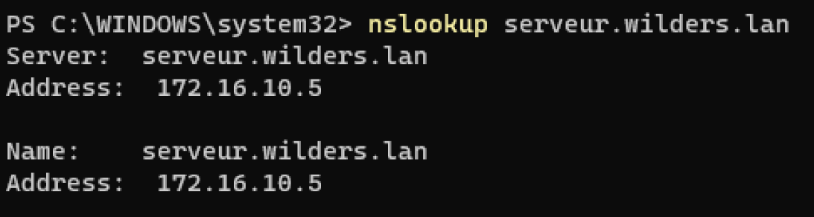
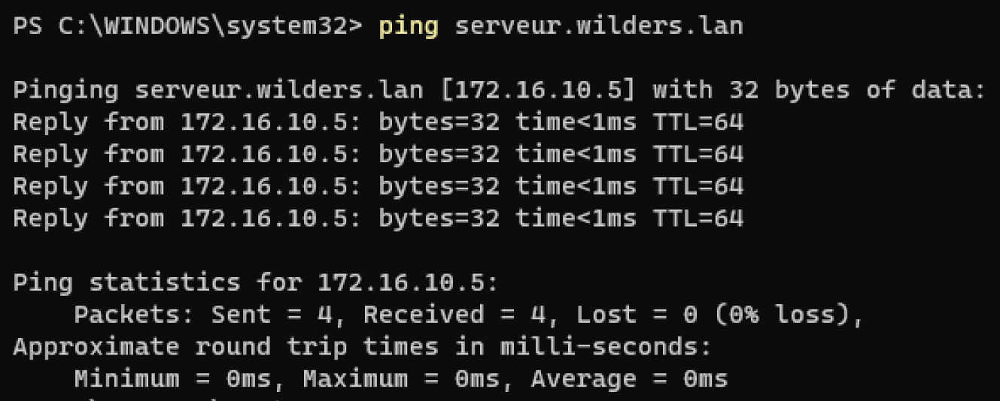
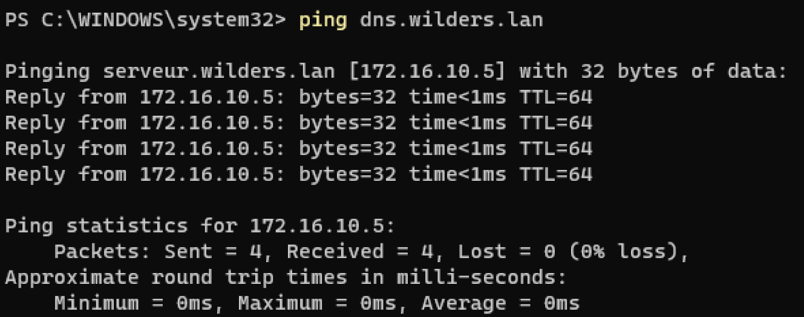
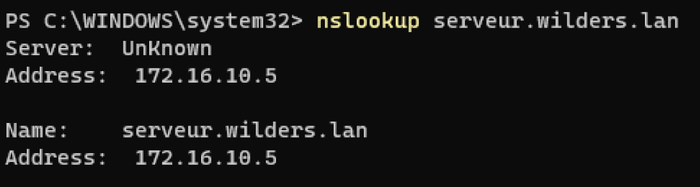

# DNS-DEBIAN 

---

## La zone de recherche se nomme wilders.lan:

## La résolution d'adresse IP est fonctionnelle (champs A):

## La résolution de l'alias est fonctionnelle (champs CNAME):

## Les tests proposés permettent effectivement de valider les points ci-dessus:

