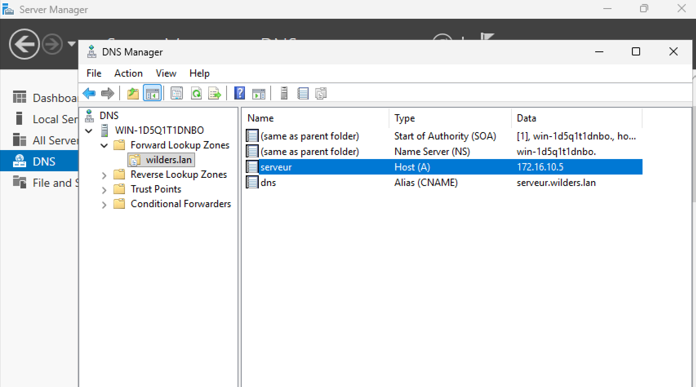
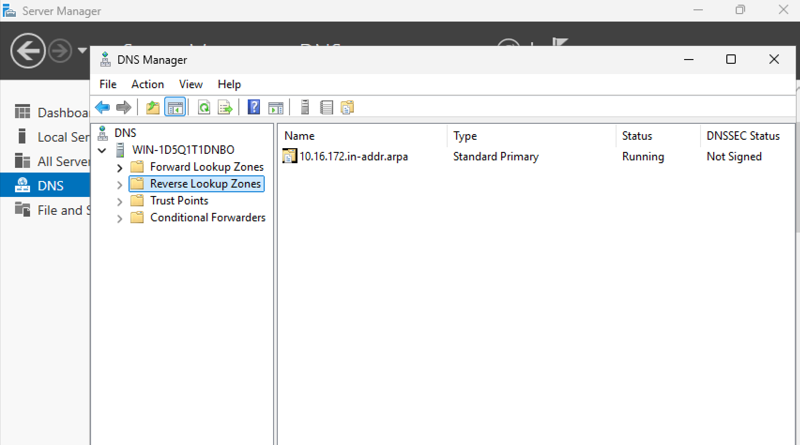
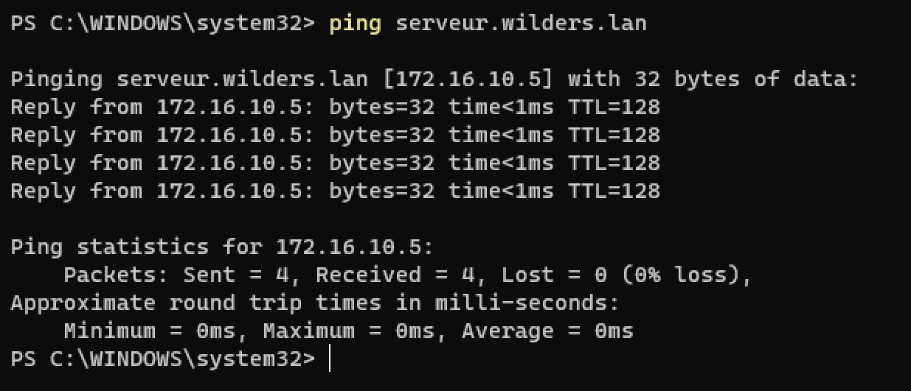
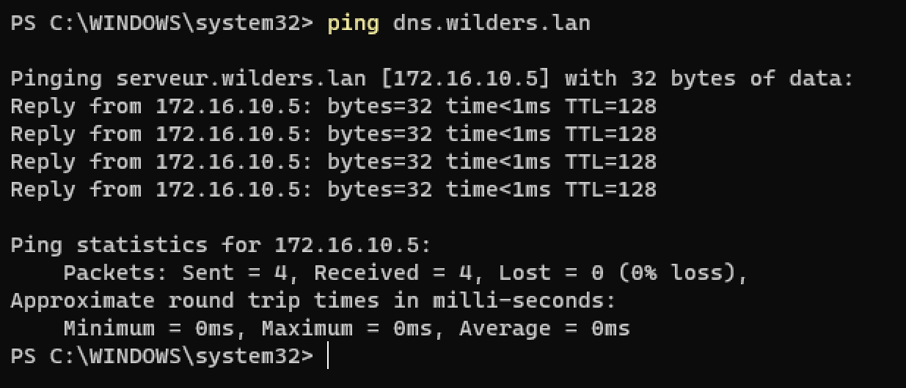
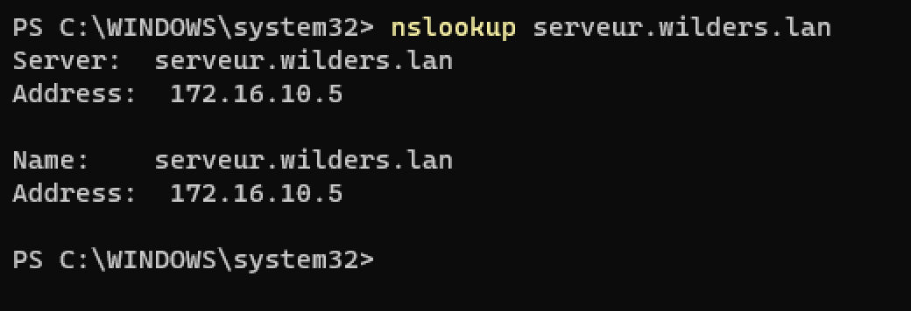

# La configuration de la zone directe du serveur:

# La configuration de la zone indirecte du serveur:

# Un ping depuis le client vers les 2 noms DNS du serveur - serveur.wilders.lan:

# Un ping depuis le client vers les 2 noms DNS du serveur - dns.wilders.lan:

# Le résultat de la commande nslookup depuis le client vers le serveur DNS:

