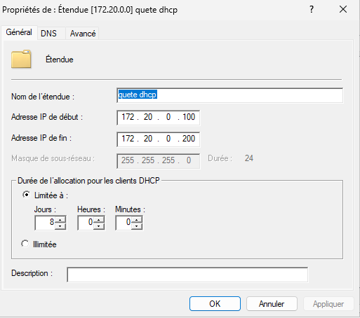
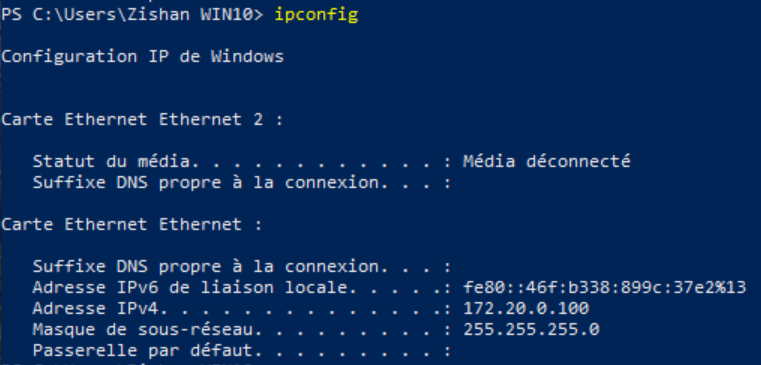
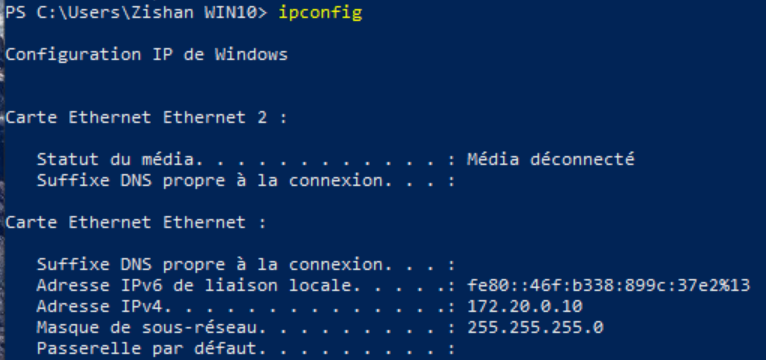
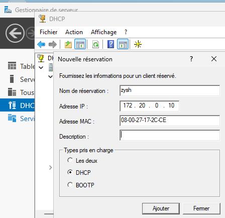

# quete_dhcp

HELLO WORLD ! 

L'étendue IP doit être visible

La configuration IP du 1er client

La configuration IP du second client

L'affichage de la fenêtre de réservation sur le serveur

DANKE SCHEUNE ! 
