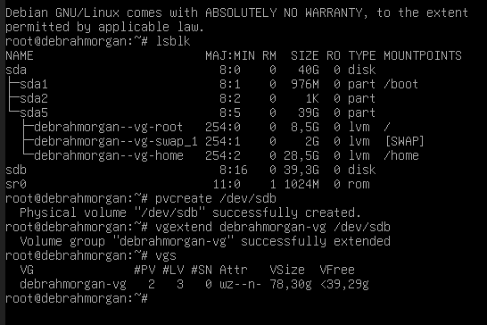
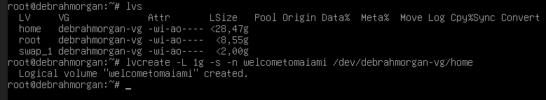
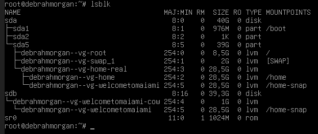
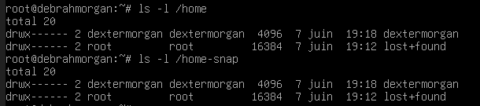
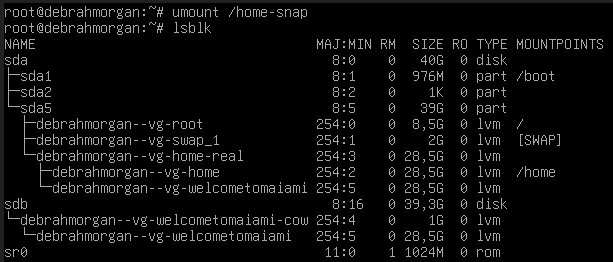
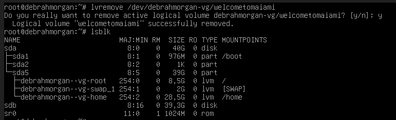

**1. Ajout du PV et doublement du VG**

**2. Création du snapshot du LV home**

**3. Montage du snapshot sur /home-snap**

**4. Contenu identique entre /home et /home-snap**

**5. Démontage de /home-snap**

**6. Destruction du snapshot**

