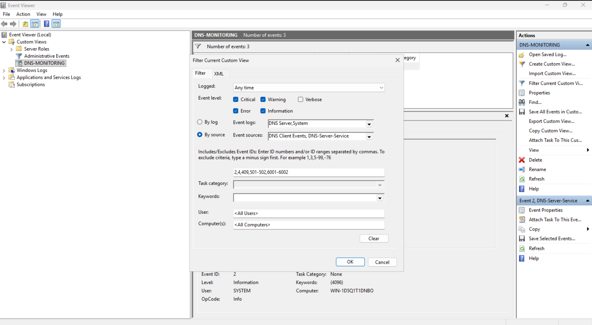

# DNS-MONITORING | VUE PERSONNALISÉE | EVENT VIEWER

La vue créer dans l'event viewer sert à la surveillance du rôle DNS mis en place plutôt. Elle surveille 4 niveaux d'incidents de la plus Critique à la simple Informations.   

Des Event ID principaux on y été ajouté pour une surveillance ciblé des évenements. 

Pour utiliser la vue, elle à été exporter au format xml comme demandé dans la quête et est [disponible ici](dnsview1.xml)
 

