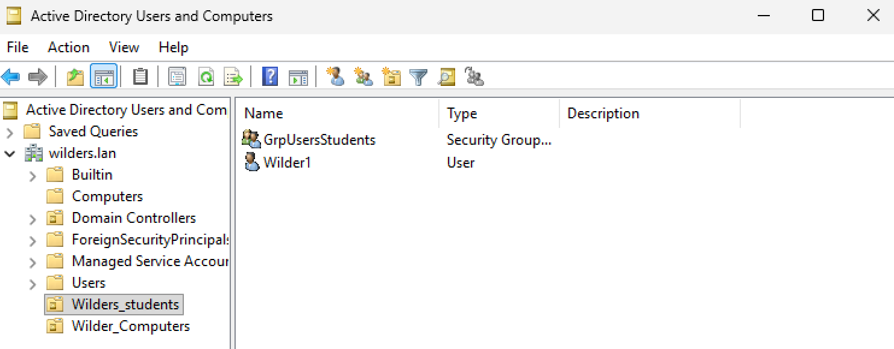
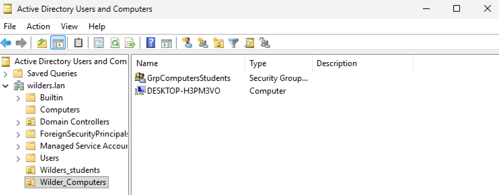
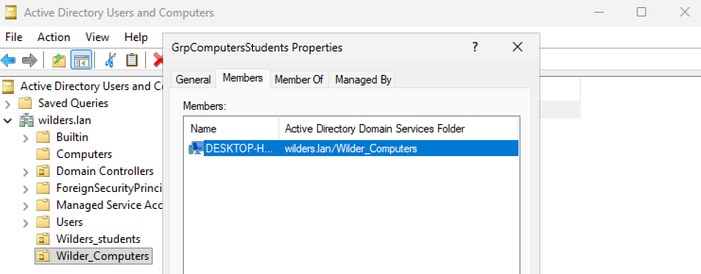
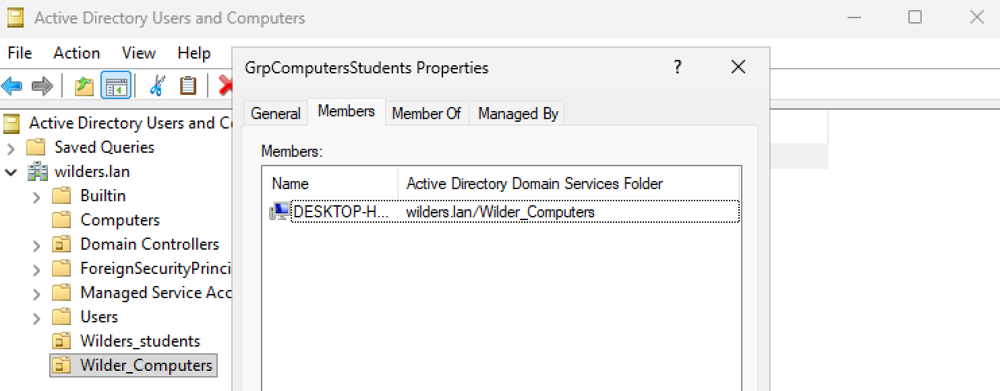
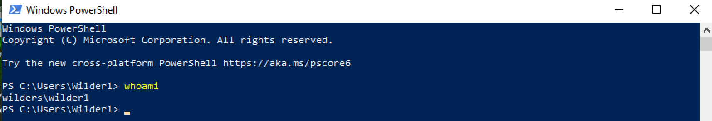

## **Quête -AD- OU & GROUPES **

**L'OU utilisateurs où on voit le compte utilisateur :**

**L'OU ordinateur où on voit le client :**

**La fenêtre du groupe utilisateur dans laquelle on voit l'utilisateur membre :**

**La fenêtre du groupe ordinateur dans laquelle on voit le client membre :**

**Sur le client, le résultat de la commande whoami :**

