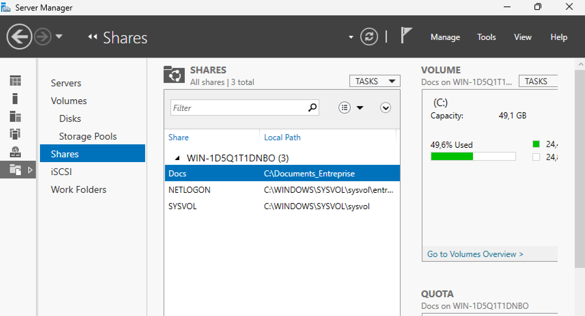
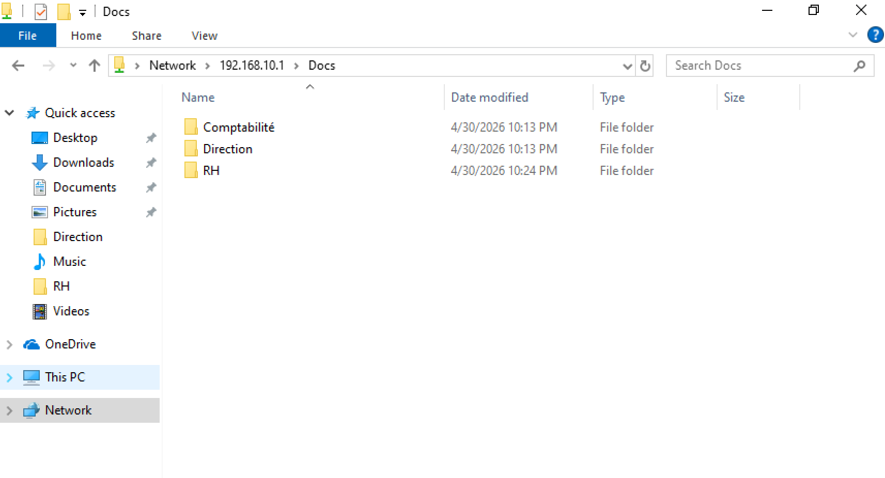
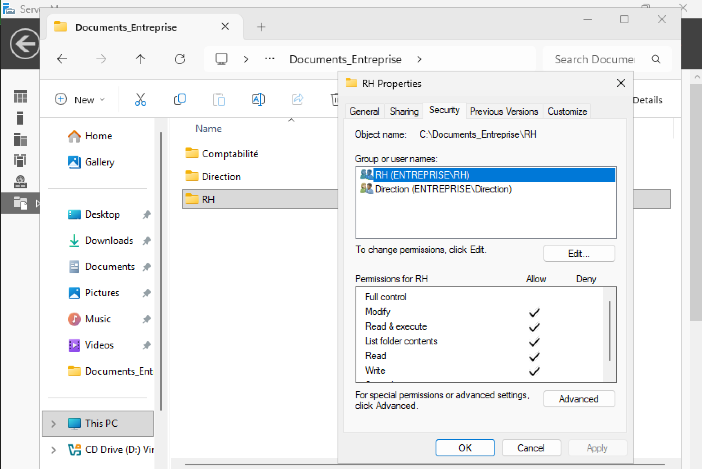
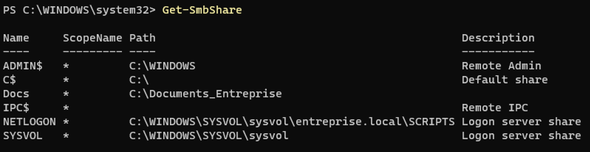
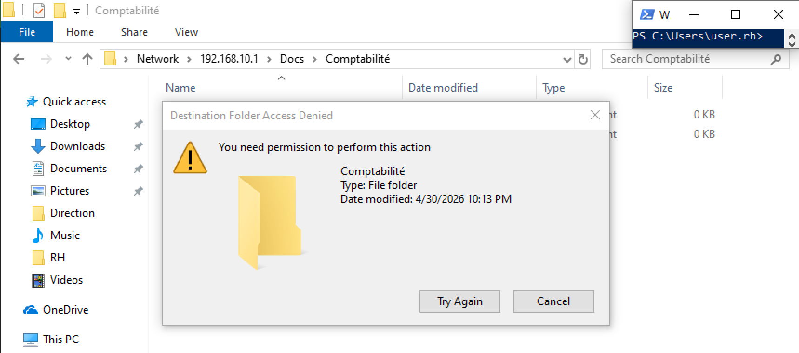

# Procédure : 

## I) Configuration serveur:

---

Pré requis de possèder une IP statique sur le même réseau que le client.

Via server manager : 
Installation de ADDS   
Promotion en contrôleur de domaine " new forest " " entreprise.local"  
Installation du rôle serveur de fichiers 

---

## II) Création d'un partage:

Création du dossier à la racine C:\  
Création du partage "Docs" : sur Properties > Sharing > Advanced Sharing > Share names : "Docs"  
Création des sous dossier dans C:\Documents_Entreprise:  

\RH  
\Comptabilité  
\Direction  

---

## III) Création des groupes et utilisateurs AD:  

Via commande: "dsa.msc" > Users :   
Création de groupe (Global, Security): RH, Comptabilité et Direction.  
Création de nouvel utilisateurs + ajout au groupe :   
- user.rh > RH  
- user.compta > Comptabilité  
- user.direction > Direction   

---

## IV) Permissions NTFS:  

Clic droit sur chaque dosser > Properties > Security > Advanced > Disable inheritance > Convert    
Puis supprimer les goupes indésirables (Everyone, Users).  
Pour finir Add + taper le nom des groupes ci dessous :   

Dossier RH :    
- RH : Modify    
- Direction : Modify   

Dossier Comptabilité :    
- Comptabilité : Modify   
- Direction : Modify   

Dossier Direction :   
- Direction : Modify   

Dossier Documents_Entreprise (racine) :  
- Domain Users : Read   

---

## V) Permission du partage:   

Clic droit sur Documents_Entreprise > Properties > SHaring > Advanced SHaring > Permissions :   
Everyone : Read + Change   

---

## VI) Vérification des partages:  

Get-Smbshare (Docs doit figurer dans la liste)  

Configuration du lecteur réseau sur le client  

Via PowerShell :   
New-PSDrive -Name "Z" -PSProvider FileSystem -Root "\\192.168.10.1\Docs" -Persist  
ou via GUI :   
Ce Pc > Map Network Drive > Drive : Z > Folder : \\\192.168.10.1\Docs > Finish  

## VII) Test de validation:  

Tester les différentes autorisation sur le client:  

user.rh: valide la création de fichier dans le dossier RH, Access Denied en comptabilité et lecture seul en Direction.   

user.direction : TOute autorisation  

---

# Critères d'acceptation :   

## Ton serveur de fichiers est correctement installé et configuré:  

---

## Le partage Docs est accessible depuis le réseau:

---

## Les permissions NTFS et de partage sont correctement appliquées :

---

## Tes commandes PowerShell pour lister les partages fonctionnent correctement :

---

## Les utilisateurs peuvent accéder uniquement aux dossiers avec les permissions attribuées :

---

