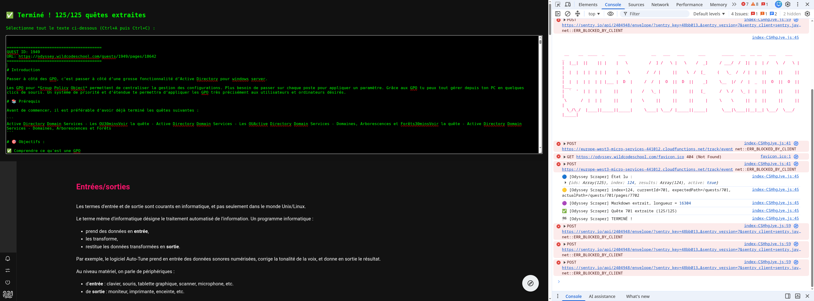

# Script d'automatisation Odyssey



## I. Script de collecte des ID

À lancer sur la page `/quests` avec tous les filtres de catégorie cochés.

```javascript
(async function() {
  const seen = new Set();

  function collectLinks() {
    document.querySelectorAll('a[href^="/quests/"]').forEach(a => {
      seen.add(a.getAttribute('href'));
    });
  }

  function clickPage(n) {
    const btn = document.querySelector(`button[aria-label="Go to page ${n}"]`);
    if (!btn) return false;
    btn.dispatchEvent(new MouseEvent('mousedown', { bubbles: true }));
    btn.dispatchEvent(new MouseEvent('mouseup', { bubbles: true }));
    btn.dispatchEvent(new MouseEvent('click', { bubbles: true }));
    return true;
  }

  collectLinks();
  console.log(`Page 1 ➜ total cumulé : ${seen.size}`);

  // Ajuste maxPage si le nombre de pages change (vérifie le total affiché)
  const maxPage = 5;

  for (let page = 2; page <= maxPage; page++) {
    const ok = clickPage(page);
    if (!ok) {
      console.log(`⚠️ Bouton page ${page} non trouvé.`);
      break;
    }
    await new Promise(r => setTimeout(r, 1200));
    collectLinks();
    console.log(`Page ${page} ➜ total cumulé : ${seen.size}`);
  }

  const links = Array.from(seen).map(href => href.replace('/quests/', ''));
  console.log(`✅ Total final : ${links.length} IDs uniques`);
  console.log(JSON.stringify(links));
})();
```

## II. Script de démarrage

À coller dans la console pour démarrer (sur la page `/quests` avec tous les filtres cochés, après avoir récupéré la liste des IDs via le script de collecte ci-dessus).

```javascript
(function() {
  const ids = ["1949","1950","1944","3966","1945","296","517","2503","2924","3092","3960","3976","3977","3033","3035","3590","3020","3957","3958","3959","3075","3077","2365","2799","2935","2850","2777","2860","3036","3054","3903","2883","2390","2852","3066","2874","3573","2372","1676","2359","2983","1951","2791","2794","1453","1445","1454","1444","2291","3912","3021","2277","2416","2335","3918","2338","2080","703","2998","2063","2426","2133","1309","2138","1313","1312","1311","2129","1410","2790","2082","1390","2337","2367","3936","2200","3129","2294","2471","2464","2270","3504","2538","3105","1545","2246","629","3084","2006","2039","2030","2781","2768","2409","2410","3041","3963","2878","3962","2848","3581","3582","3583","3135","2861","2866","2873","2103","3964","2356","2358","2316","2041","3961","3978","2934","2350","3042","3823","1977","2274","2114","1315","1316","701"];

  localStorage.setItem('odyssey_scrape_state', JSON.stringify({
    ids: ids,
    index: 0,
    results: [],
    active: true
  }));

  console.log(`🚀 Démarrage ! ${ids.length} quêtes en file.`);
  window.location.href = '/quests/' + ids[0];
})();
```

## III. Script Tampermonkey

```javascript
// ==UserScript==
// @name         Odyssey Scraper
// @namespace    odyssey-scraper
// @version      1.1
// @description  Extraction automatique des quêtes Odyssey
// @match        https://odyssey.wildcodeschool.com/quests/*
// @grant        none
// ==/UserScript==

(function() {
    'use strict';

    console.log('🟢 [Odyssey Scraper] Script chargé sur', window.location.pathname);

    const STORAGE_KEY = 'odyssey_scrape_state';

    function getState() {
        const raw = localStorage.getItem(STORAGE_KEY);
        return raw ? JSON.parse(raw) : null;
    }

    function saveState(state) {
        localStorage.setItem(STORAGE_KEY, JSON.stringify(state));
    }

    function extractMarkdown() {
        const content = document.querySelector('div.css-1fpw8tv');
        if (!content) return null;

        // Récupère le titre de la quête (en dehors du conteneur de contenu)
        let title = '';
        const titleEl = document.querySelector('h1, h2, [class*="title"]');
        // Cherche plus précisément le titre affiché en haut de page (hors contenu)
        const headerTitle = Array.from(document.querySelectorAll('div, h1, h2'))
            .find(el => el.textContent && el.textContent.trim().length > 0 && !content.contains(el) && el.tagName !== 'DIV');
        if (document.title) title = document.title.replace(' - Odyssey', '').replace('Odyssey', '').trim();

        const clone = content.cloneNode(true);
        clone.querySelectorAll('h1 a, h2 a, h3 a').forEach(a => a.remove());
        clone.querySelectorAll('svg, button').forEach(el => el.remove());

        function htmlToMd(node) {
            let md = '';
            node.childNodes.forEach(child => {
                if (child.nodeType === Node.TEXT_NODE) {
                    md += child.textContent;
                } else if (child.nodeType === Node.ELEMENT_NODE) {
                    const tag = child.tagName.toLowerCase();

                    if (tag === 'table') {
                        const rows = Array.from(child.querySelectorAll('tr'));
                        rows.forEach((row, i) => {
                            const cells = Array.from(row.querySelectorAll('th, td')).map(c => htmlToMd(c).trim());
                            md += `| ${cells.join(' | ')} |\n`;
                            if (i === 0) md += `| ${cells.map(() => '---').join(' | ')} |\n`;
                        });
                        md += '\n';
                        return;
                    }

                    const inner = htmlToMd(child);
                    if (tag === 'h1') md += `\n# ${inner.trim()}\n\n`;
                    else if (tag === 'h2') md += `\n## ${inner.trim()}\n\n`;
                    else if (tag === 'h3') md += `\n### ${inner.trim()}\n\n`;
                    else if (tag === 'p') md += `${inner}\n\n`;
                    else if (tag === 'em' || tag === 'i') md += `*${inner}*`;
                    else if (tag === 'strong' || tag === 'b') md += `**${inner}**`;
                    else if (tag === 'br') md += `\n`;
                    else if (tag === 'pre') md += `\n\`\`\`\n${child.textContent.trim()}\n\`\`\`\n\n`;
                    else if (tag === 'code') md += `\`${child.textContent}\``;
                    else if (tag === 'ul') md += `${inner}\n`;
                    else if (tag === 'li') md += `- ${inner.trim()}\n`;
                    else if (tag === 'img') md += '';
                    else if (tag === 'a') md += `[${inner}](${child.href})`;
                    else if (tag === 'div' || tag === 'article') md += `${inner}\n`;
                    else md += inner;
                }
            });
            return md;
        }

        const body = htmlToMd(clone).replace(/\n{3,}/g, '\n\n').trim();
        const titleLine = title ? `# ${title}\n\n` : '';
        return titleLine + body;
    }

    function showFinalResult(state) {
        const banner = document.createElement('div');
        banner.style = 'position:fixed;top:0;left:0;right:0;background:#111;color:#0f0;padding:20px;z-index:99999;font-family:monospace;max-height:90vh;overflow:auto;';
        const textarea = document.createElement('textarea');
        textarea.style = 'width:100%;height:400px;background:#000;color:#0f0;font-family:monospace;';
        textarea.value = state.results.map(r => `\n\n========================================\nQUEST ID: ${r.id}\nURL: ${r.url}\n========================================\n\n${r.markdown}`).join('\n');
        banner.innerHTML = `<h2>✅ Terminé ! ${state.results.length}/${state.ids.length} quêtes extraites</h2><p>Sélectionne tout le texte ci-dessous (Ctrl+A puis Ctrl+C) :</p>`;
        banner.appendChild(textarea);
        document.body.appendChild(banner);
    }

    function run() {
        const state = getState();
        console.log('🔵 [Odyssey Scraper] État lu :', state);

        if (!state || !state.active) {
            console.log('⚪ [Odyssey Scraper] Pas actif, on arrête.');
            return;
        }

        const currentId = state.ids[state.index];
        const expectedPath = '/quests/' + currentId;
        console.log(`🟡 [Odyssey Scraper] index=${state.index}, currentId=${currentId}, expectedPath=${expectedPath}, actualPath=${window.location.pathname}`);

        if (!window.location.pathname.startsWith(expectedPath)) {
            console.log('⚠️ [Odyssey Scraper] Chemin ne correspond pas, on attend.');
            return;
        }

        const markdown = extractMarkdown();
        console.log('🟣 [Odyssey Scraper] Markdown extrait, longueur =', markdown ? markdown.length : 'NULL');

        state.results.push({
            id: currentId,
            url: window.location.href,
            markdown: markdown || '⚠️ CONTENU NON TROUVÉ'
        });
        state.index++;

        console.log(`✅ [Odyssey Scraper] Quête ${currentId} extraite (${state.index}/${state.ids.length})`);

        if (state.index >= state.ids.length) {
            state.active = false;
            saveState(state);
            console.log('🏁 [Odyssey Scraper] TERMINÉ !');
            showFinalResult(state);
        } else {
            saveState(state);
            const nextId = state.ids[state.index];
            console.log('➡️ [Odyssey Scraper] Navigation vers', nextId);
            setTimeout(function() {
                window.location.href = '/quests/' + nextId;
            }, 500);
        }
    }

    window.addEventListener('load', function() {
        console.log('🟠 [Odyssey Scraper] Event load déclenché, attente 5s...');
        setTimeout(run, 5000);
    });

    if (document.readyState === 'complete') {
        console.log('🟠 [Odyssey Scraper] Document déjà complete, attente 5s...');
        setTimeout(run, 5000);
    }
})();
```

---
---


### Le problème de départ

Odyssey est une **Single Page Application** (React + Material UI) — pas un site classique où chaque URL renvoie une page HTML complète et indépendante. Conséquence directe : `web_fetch` ne voit qu'une coquille vide (`<div id="root"></div>`), parce que tout le contenu est généré **après coup** par du JavaScript, côté navigateur, une fois la page chargée et que tu es authentifié. Aucun outil externe ne peut "voir" ce contenu sans passer par ton navigateur connecté.

### Pourquoi la console DevTools

Comme le contenu n'existe que dans **ton** navigateur avec **ta** session active, la seule façon d'y accéder par script, c'était d'exécuter du code directement **dans** cette session — via la console JavaScript de Chrome (F12 → Console). C'est un terminal qui exécute du JS avec un accès complet au DOM (la structure HTML) de la page actuellement affichée, comme si c'était toi qui cliquais, mais en code.

### Étape 1 : Comprendre la structure du DOM

Avant d'écrire le moindre script, on a dû **inspecter** (clic droit → Inspecter) pour voir comment Odyssey organise son HTML : quelles classes CSS contiennent le contenu d'une quête, où se trouve le lien vers chaque quête, etc. C'est indispensable parce que sans connaître les bonnes "poignées" (sélecteurs CSS comme `div.css-1fpw8tv`), un script ne sait pas où chercher.

### Étape 2 : Extraire et convertir le HTML en Markdown

Le script `htmlToMd()` parcourt récursivement chaque balise HTML (`<h1>`, `<p>`, `<table>`, etc.) et la traduit en syntaxe Markdown équivalente (`# titre`, texte simple, `| tableau |`). C'est une petite fonction de **conversion de format** — du HTML structuré vers du texte structuré plus simple, exploitable dans Obsidian.

### Étape 3 : Collecter les 125 identifiants de quêtes

Pour savoir quelles pages visiter, on a dû lister tous les liens `/quests/{id}` présents dans le DOM. Complication : la pagination (5 pages de résultats) signifiait qu'il fallait **simuler des clics** sur les boutons "page suivante" via du JavaScript (`dispatchEvent`), puis attendre le temps que React affiche le nouveau contenu avant de continuer.

### Étape 4 : Le vrai défi technique : naviguer sans perdre l'état

Changer l'URL recharge entièrement la page, ce qui **tue** n'importe quel script en cours d'exécution dans la console — toutes les variables sont perdues à chaque rechargement. La solution a été d'utiliser le **`localStorage`** du navigateur : une petite base de données clé-valeur qui **survit** aux rechargements de page. On y stocke où on est rendu (`index`), la liste complète des IDs à visiter, et les résultats déjà collectés.

### Étape 5 : Tampermonkey, le chaînon manquant

Le `localStorage` permet de garder l'état, mais il fallait aussi qu'un script se **relance automatiquement** après chaque rechargement de page — chose qu'une simple console ne fait pas (il faut recoller le code à la main). Tampermonkey est une extension qui **réinjecte automatiquement** un script chaque fois qu'une page correspondant à un certain motif d'URL (`@match`) se charge. C'est ce qui a permis la boucle complète : charger une quête → attendre 5 secondes → lire l'état dans `localStorage` → extraire le contenu → l'ajouter aux résultats → incrémenter l'index → naviguer vers la quête suivante → recommencer.

### Pourquoi ça n'a pas marché du premier coup

Plusieurs couches de friction classiques en automatisation web :

- Chrome bloque le collage de scripts par sécurité (`allow pasting`)
- Chrome bloque aussi l'accès au presse-papier riche si l'onglet n'a pas le focus (`clipboard.write()`)
- Chrome a une option séparée, désactivée par défaut, pour autoriser l'exécution de userscripts tiers
- Les clics simulés en JS pur (`.click()`) ne déclenchent pas toujours les gestionnaires d'événements React — il a fallu simuler la séquence complète `mousedown` → `mouseup` → `click`


